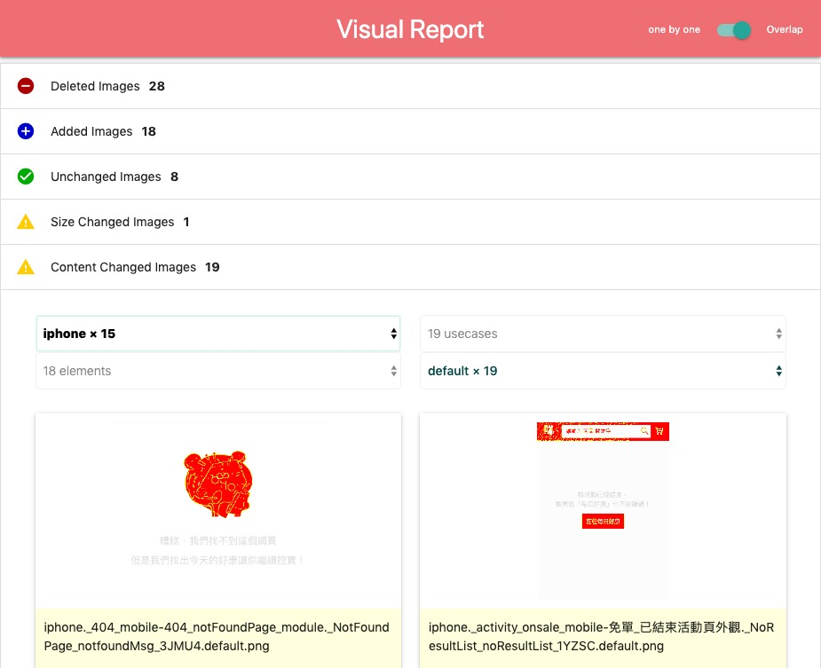
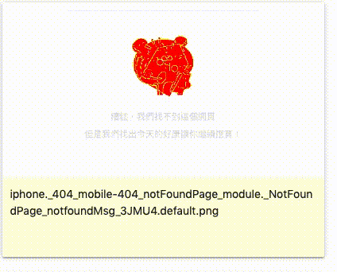

visual-reporter
===============

[](https://travis-ci.org/zordius/visual-reporter) <a href="https://www.npmjs.com/package/visual-reporter"></a> [](LICENSE)

Generate Visual Changes Report, here is a life DEMO:

<a href="https://zordius.github.io/visual-reporter/"></a>

Features:
 * One command line tool to generate visual report as static HTML.
 * View visual difference as overlap changes or different images.
 * Options to customize the report.
 * Grouping images by seperator in file names.

<a href="https://zordius.github.io/visual-reporter/"></a>

Usage
-----

```
$ npm install visual-reporter -g
$ visual-reporter --help

Usage: visual-reporter [options] [command]

Options:
  -V, --version               output the version number
  -b --baseline <dir>         baseline directory, default is "."
  -c --compare <dir>          compare directory, default is "./compare"
  -r --report <dir>           report directory, default is "./report"
  -s --seperator <match>      group seperator, default is "."
  -w --writeInfo              generate a brief infomation file "info.txt", default is false
  -k --keepUnchanged          keep unchanged diff image, default is false
  -g --groups <g1,g2,g3,...>  group names, default is "groups"
  -m --customStyle <css>      add custom css into report
  -t --threshold <0...1>      matching threshold, default is 0.1
  -i --includeAA              do not detecting anti-aliased pixels, default is false
  -a --alpha <0...1>          alpha of unchanged pixels, default is 0.1
  -h, --help                  output usage information

Commands:
  generate|gen                Generate visual report
```

Usecases
--------

* Put your old visual files into a directory as `baseline`.
* Run your visual automation testing.
* New generated visual files are placed in another directory as `compare`.
* Generate your visual report:
```
$ visual-reporter gen --baseline path/to/baseline --compare path/to/compare
```

* When you named your image files as [browser]_[testCase].png, you can enable grouping by:
```
files:
chrome_login.png
chrome_logout.png
iphone_login.png
iphone_logout.png

$ visual-reporter gen --baseline baseline --compare compare --seperator '_' --groups browser,testcase
```

* By default, the image description is the file name. You can customize the image description in the report by placing *.txt files besides the *.png files:
```
files:
chrome_login.png
chrome_logout.png
iphone_login.png
iphone_logout.png

descriptions:
chrome_login.txt
iphone_login.txt
```

* The image comparison is done by <a href="https://github.com/mapbox/pixelmatch">pixelmatch</a>, you can pass more options to it.
```
$ visual-reporter gen --baseline foo --compare bar --seperator --alpha 0.3 --threshold 0.3 --includeAA
```

Error Codes
-----------

The error code will be sum of detected change types:

| Change Type                  | Exit Code |
|------------------------------|-----------|
| No any chnages are detected  | 0         |
| new image files are detected | 1         |
| old image files are missing  | 2         |
| image size is changed        | 4         |
| image content is changed     | 8         |

